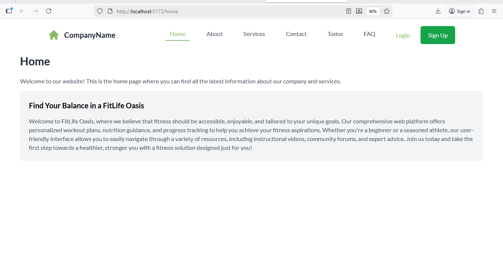
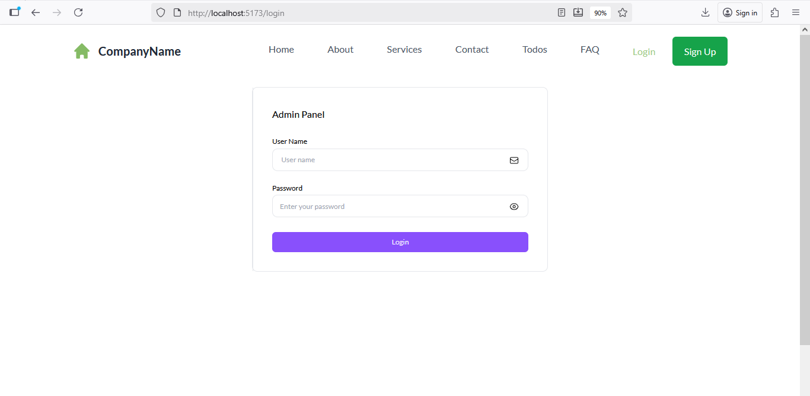
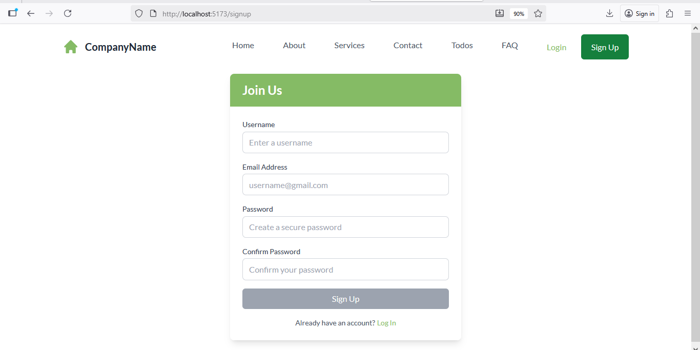
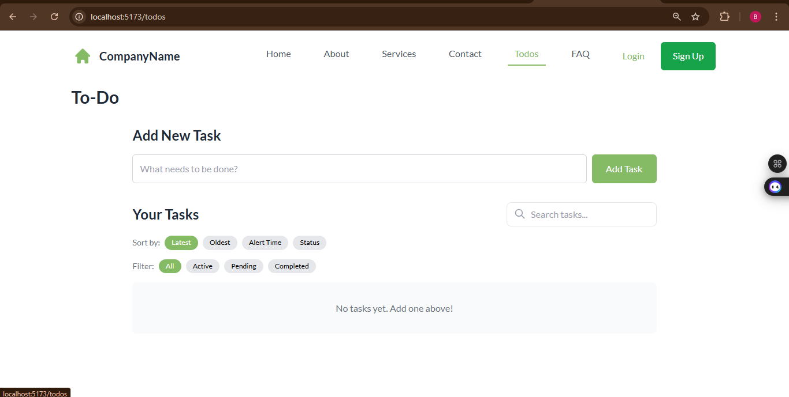
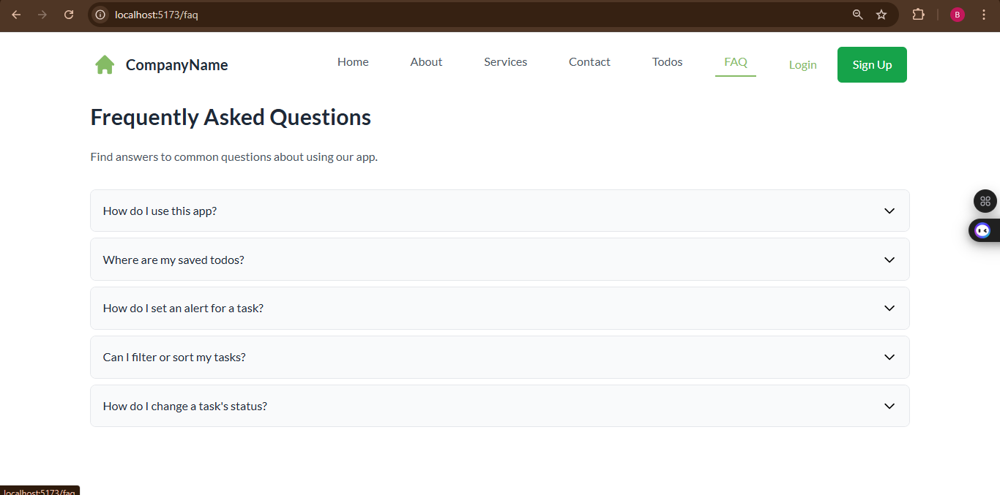
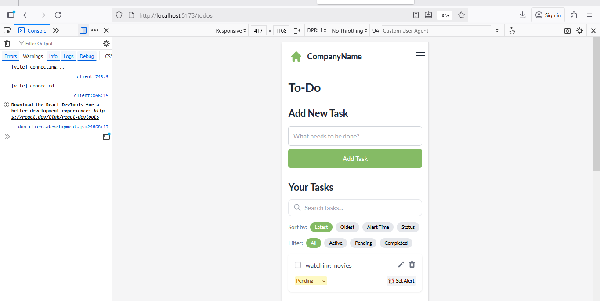

# React Component Playground

[](https://reactjs.org/)
[](https://vitejs.dev/)
[](https://tailwindcss.com/)
[](https://opensource.org/licenses/MIT)
[](https://github.com/Betelihemaraya)

## 🎯 Purpose

The React Component Playground is a comprehensive demonstration application that showcases modern React development practices, component architecture, and user interface design. This project serves as both a learning resource and a portfolio piece, demonstrating proficiency in:

- **Component Architecture**: Modular, reusable React components
- **State Management**: Custom hooks and form handling
- **Routing**: Single-page application navigation
- **Styling**: Modern CSS with Tailwind CSS
- **Form Validation**: User input validation and error handling
- **Responsive Design**: Mobile-first, accessible interfaces

## 🚀 Technologies Used

| Technology | Version | Purpose |
|------------|---------|---------|
| **React** | 19.0.0 | Frontend framework |
| **Vite** | 6.2.4 | Build tool and development server |
| **React Router DOM** | 7.4.1 | Client-side routing |
| **Tailwind CSS** | 3.4.17 | Utility-first CSS framework |
| **Formik** | 2.4.6 | Form state management |
| **React Hook Form** | 7.55.0 | Form validation and handling |
| **Yup** | 1.6.1 | Schema validation |
| **Heroicons** | 2.2.0 | Icon library |
| **Motion** | 12.6.2 | Animation library |
| **ESLint** | 9.21.0 | Code linting and quality |

## ✨ Features Implemented

### 🔐 Authentication System
- **Login/Signup Forms**: Complete user authentication flow
- **Form Validation**: Real-time input validation with error messages
- **Responsive Design**: Mobile-optimized authentication interfaces

### 📝 Todo Management
- **CRUD Operations**: Create, read, update, and delete todos
- **Custom Hooks**: Reusable state management with `useTodos`
- **Form Handling**: Add and edit todo items with validation
- **Alert System**: User feedback for actions

### 🎛️ Interactive Components
- **Accordion Component**: Collapsible content sections
- **Navigation Bar**: Responsive navigation with active states
- **Custom Hooks**: Reusable logic with `useNavbar`

### 🎨 User Experience
- **Responsive Design**: Mobile-first approach
- **Modern UI**: Clean, professional interface
- **Smooth Animations**: Enhanced user interactions
- **Accessibility**: Semantic HTML and keyboard navigation

### 🏗️ Code Quality
- **Modular Architecture**: Feature-based folder structure
- **Component Composition**: Reusable, maintainable components
- **Custom Hooks**: Separation of logic and presentation
- **ESLint Configuration**: Code quality and consistency
- **TypeScript Support**: Type safety and better development experience

## 🚀 How to Run the Project

### Prerequisites
- Node.js (version 16 or higher)
- npm or yarn package manager

### Installation Steps

1. **Clone the repository**
   ```bash
   git clone https://github.com/Betelihemaraya/react-component-playground.git
   cd react-component-playground
   ```

2. **Install dependencies**
   ```bash
   npm install
   ```

3. **Start the development server**
   ```bash
   npm run dev
   ```

4. **Open your browser**
   - Navigate to `http://localhost:5173`
   - The application will automatically reload when you make changes

### Available Scripts

```bash
npm run dev      # Start development server
npm run build    # Build for production
npm run preview  # Preview production build
npm run lint     # Run ESLint
```

## 📁 Project Structure

```
react-component-playground/
├── public/                     # Static assets
│   └── vite.svg              # Vite logo
├── src/                       # Source code
│   ├── assets/               # Static assets
│   │   ├── css/              # CSS files
│   │   │   └── wind.css      # Custom styles
│   │   └── react.svg         # React logo
│   ├── features/             # Feature-based modules
│   │   ├── accordion/        # Accordion component feature
│   │   │   ├── components/   # Accordion components
│   │   │   └── pages/        # Accordion pages
│   │   ├── auth/             # Authentication feature
│   │   │   ├── Login.jsx     # Login component
│   │   │   ├── Signup.jsx    # Signup component
│   │   │   └── validation.js # Form validation schemas
│   │   ├── navigation/       # Navigation feature
│   │   │   ├── Navbar.jsx    # Navigation component
│   │   │   └── useNavbar.jsx # Navigation hook
│   │   ├── pages/            # Main pages
│   │   │   ├── About.jsx     # About page
│   │   │   ├── Contact.jsx   # Contact page
│   │   │   ├── Home.jsx      # Home page
│   │   │   └── Services.jsx  # Services page
│   │   └── todos/            # Todo management feature
│   │       ├── components/   # Todo components
│   │       ├── hooks/        # Custom hooks
│   │       └── pages/        # Todo pages
│   ├── App.jsx               # Main application component
│   └── main.jsx              # Application entry point
├── assets/                    # Project assets
│   ├── images/               # Images and diagrams
│   └── screenshots/           # Application screenshots
├── tests/                     # Test files
│   └── App.test.js           # Main test file
├── .gitignore                # Git ignore rules
├── daily.md                  # Daily contribution log
├── eslint.config.js          # ESLint configuration
├── index.html                # HTML template
├── LICENSE                   # MIT License
├── package.json              # Dependencies and scripts
├── postcss.config.js         # PostCSS configuration
├── README.md                 # Project documentation
└── tailwind.config.js        # Tailwind CSS configuration
```

## 📸 Screenshots

### Home Page

*Clean, modern homepage with navigation and feature highlights*

### Authentication

*Responsive login form with validation*


*User registration with form validation*

### Todo Management

*Interactive todo list with CRUD operations*

### Accordion Component

*Collapsible accordion component for FAQs*

### Responsive Design

*Mobile-optimized responsive design*

## 🤝 Contributing

We welcome contributions to improve the React Component Playground! Here's how you can contribute:

### Getting Started
1. Fork the repository
2. Create a feature branch: `git checkout -b feature/amazing-feature`
3. Make your changes and commit: `git commit -m 'Add amazing feature'`
4. Push to the branch: `git push origin feature/amazing-feature`
5. Open a Pull Request

### Development Guidelines
- Follow the existing code style and structure
- Write meaningful commit messages
- Add tests for new features
- Update documentation as needed
- Ensure all tests pass before submitting

### Code Style
- Use ESLint for code quality
- Follow React best practices
- Write clean, readable code
- Add comments for complex logic

## 📄 License

This project is licensed under the MIT License - see the [LICENSE](LICENSE) file for details.

## 👨‍💻 Author

**Betelihem Araya**
- GitHub: [@Betelihemaraya](https://github.com/Betelihemaraya)
- LinkedIn: [betelihem-araya](https://linkedin.com/in/betelihem-araya)

## 🙏 Acknowledgments

- **React Team** - For the amazing React framework
- **Vite Team** - For the fast build tool
- **Tailwind CSS Team** - For the utility-first CSS framework
- **Heroicons** - For the beautiful icon set
- **Formik & React Hook Form** - For excellent form handling libraries
- **Open Source Community** - For the incredible tools and libraries

## 📊 Project Statistics

- **Components**: 15+ reusable React components
- **Features**: 4 major feature modules
- **Custom Hooks**: 2 custom hooks for state management
- **Pages**: 7 different application pages
- **Responsive**: Mobile-first design approach
- **Accessibility**: WCAG compliant components

---

⭐ **Star this repository** if you found it helpful!

🔗 **Connect with me** on [LinkedIn](https://linkedin.com/in/betelihem-araya) for collaboration opportunities!